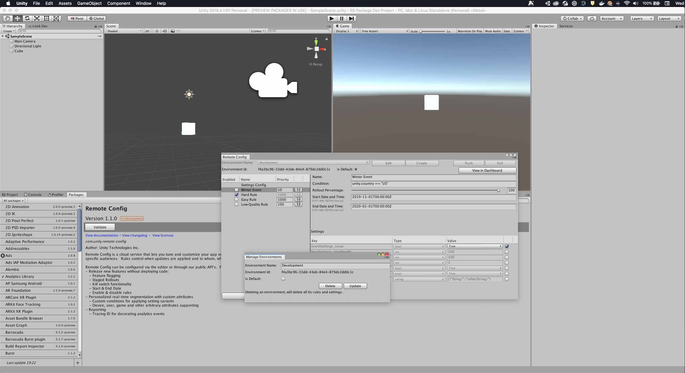
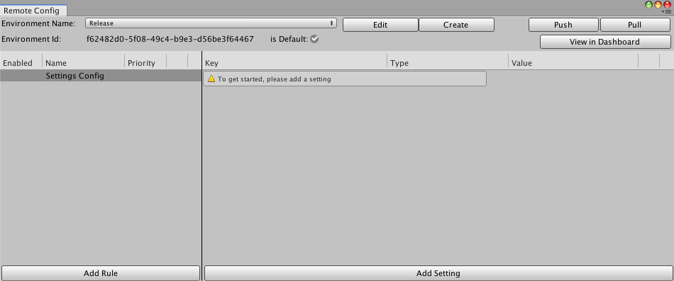
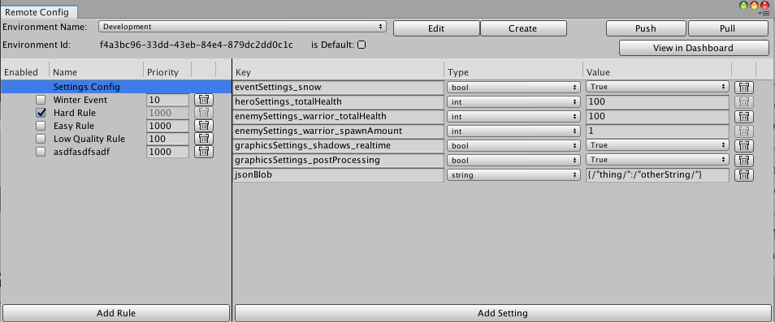

# Environments

Unity Remote Config uses Environments to group Rules and Settings, and deliver specific Environments to the client (Unity Runtime Instance) based on the `environmentId`. If no `environmentId` is provided in the request the default Environment is returned to that instance.

In the Unity Editor, select **Window** > **Remote Config** to open the **Remote Config** window.

Use the **Remote Config** window to manage your Remote Config Environments. Upon initialization in a new Project, only the default Environment is available.

**Note**: Each Environment has a unique set of Rules and Settings. Before you configure Rules and Settings for your game, make sure you select the correct Remote Config Environment in the **Remote Config** window.

## Restrictions

- A Project can have a maximum of 10 Environments
- Environment names must be unique
- The `Development` Environment name is reserved and cannot be created by users.

## Working with Environments
The **Remote Config** window lets you create, edit, and delete Environments. This functionality is also available in the [REST APIs](RESTAPI.md) and [Web Dashboard](WebDashboard.md) if you prefer to work outside of the Editor.

Each Environment has the following main parameters.

| **Parameter** | **Description** |
| ------------- | --------------- |
| **Environment Name** | The readable identifier for the Environment. For example, you might name an Environment to match a given build of your game `com.Unity.MyGame@1.1.1`; or for a team member, to let them work independently of the Settings used by others `@yourNameGoesHere`.|
| **Environment Id** | The generated UUID (universally unique identifier) for the Environment. The client uses this when requesting the Rules and Settings. <br>This parameter is required for integration.|
| **is Default** | Sets the Environment as the default Environment, which is returned to a Unity Instance when the request contains no `environmentId` or an invalid `environmentId`.|


### Creating new Environments
To create a new Remote Config Rule in the **Remote Config** window, click the **Create** button and name the Environment.
<br><br>

### Editing Environments
To edit a Remote Config Environment in the **Remote Config** window, click the **Edit** button and rename the Environment or set it as default.
<br><br>

### Selecting an Environment ID
You can set which `environmentId` the client requests with the method:

```
ConfigManager.SetEnvironmentID("001122-334455-6789");
```

### Selecting a non-default Environment
For package versions 1.1.0+, the instance can receive Rules and Settings from a non-default `environmentId`. To specify this, use the ConfigManager API method `SetEnvironmentID` in the outgoing request.





#### Default Environment for 1.0.x package upgrades
- The `Release` Environment is set as default when upgrading from an older version of the package.
- The `Development` Environment is only delivered by default on Development Builds for packages <= 1.0.x.

## Example use cases
Below are some examples of how you can utilize Environments for your Project.

### Development workflow

### Build-specific Environments

### Levels or App sections

## Rules and Settings
Once you’ve configured your Environments, continue integrating by creating [Rules and Settings](RulesAndSettings.md).

## Upgrade Notes for Developers using Package Versions < 1.1.x

- Only the Development and Release environments are available for use in versions of the package < 1.1.x
- Upon downgrading environments other than `Development` Environment and the environment which is set as **default** will still exist but not be usable for clients built by  package versions <= 1.0.x .
- Upon downgrading to a package version <= 1.0.x, an environment named `Development` will be created if it did not already exist. This supports delivery to clients built as Development Builds for those older package versions.