# Rules and Settings

Unity Remote Config uses __Rules__ to target specific user groups and deliver different settings for each group. Rules are linked to __Settings__, which you’ll map to variables in your game code to override their default values when the audience criteria for a Rule is met.

Plan Remote Config settings early, when you design your game or before a new deployment. Unity recommends including inert Remote Config settings with your initial deployment, which you can later apply once you understand how your audience uses your game, and how it performs on different devices.

In the Unity Editor, select **Window** > **Remote Config** to open the **Remote Config** window.

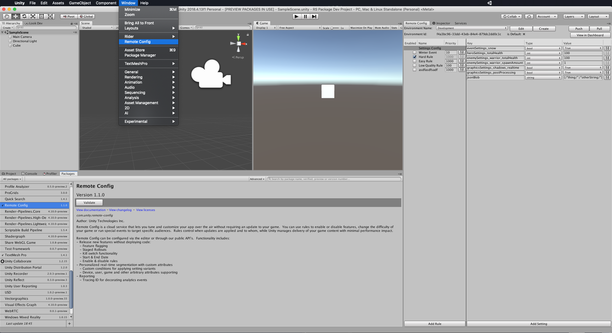

Use the **Remote Config** window to configure your Remote Config Rules and Settings. Rules dictate conditions or player segments through which to surface Settings. By default, you start with one config **Settings Config**. This config contains the default Settings that all users receive unless an active Rule with [higher priority](#prioritizing-rules) applies.

**Important**: Each [environment](ConfiguringYourProject.md#remote-config-environments) has a unique Rules set. Before configuring Rules for your game, make sure you select the correct Remote Config environment in the **Remote Config** window.

A Setting is a key/value pair. You will map the key name to a variable in your game code, so you can dynamically change its value without changing your code.

## Adding new Settings
The default **Settings Config** config contains every Setting you create for a given environment. To create a new Setting, highlight the **Settings Config** config, then click the **Add Setting** button at the bottom of the right panel.

**Note**: You must create Settings in the Editor, since that is where the game code can consume them. However, once you’ve created Settings in the game binary, you can also update them using the Remote Config [REST APIs](RESTAPI.md) or the Remote Config [Web Dashboard](WebDashboard.md).

Each Setting consists of a **Key**, **Type**, and **Value**:

| **Parameter** | **Description** | **Example** |
| ------------- | --------------- | ----------- |
| **Key** | The name of the Setting, which must adhere to the following rules:<br><br><ul><li>Must be unique within its environment.</li><li>Must start with a letter.</li><li>May only contain letters, digits, periods, underscores, or hyphens.</li><li>May not exceed 255 characters.</li></ul> | <ul><li>`enemyHealth`</li><li>`eventPackPrice`</li><li>`enableBetaFeature`</li></ul> |
| **Type** | The C# variable data type of the Setting value. Supported types include:<br><br><ul><li>`Int`</li><li>`Float`</li><li>`Bool`</li><li>`String`</li><li>`Long`</li><li>`Json`</li></ul> | <ul><li>`int`</li><li>`float`</li><li>`bool`</li><li>`string`</li><li>`long`</li><li>`json`</li></ul> |
| **Value** | The value for this Setting, which must adhere to the following rules:<br><br><ul><li>Int values are 32-bit integers (–2147483648 to 2147483647).</li><li>Float values are single-precision, 32-bit floating-point numbers.</li><li>Strings are limited to 10000 characters.</li><li>Booleans can only be true or false.</li><li>Long values are 64-bit signed integers (-9,223,372,036,854,775,808 to 9,223,372,036,854,775,807)</li><li>Json value is any valid json supported by ECMA-404 standard</li></ul> | <ul><li>`100`</li><li>`4.99`</li><li>`true`</li><li>`‘jack-o-lantern’`</li><li>`123456789012345`</li><li>`{"jsonKey1": {"jsonSubKey1": "on","jsonSubKey2": "off"}}`</li></ul> |


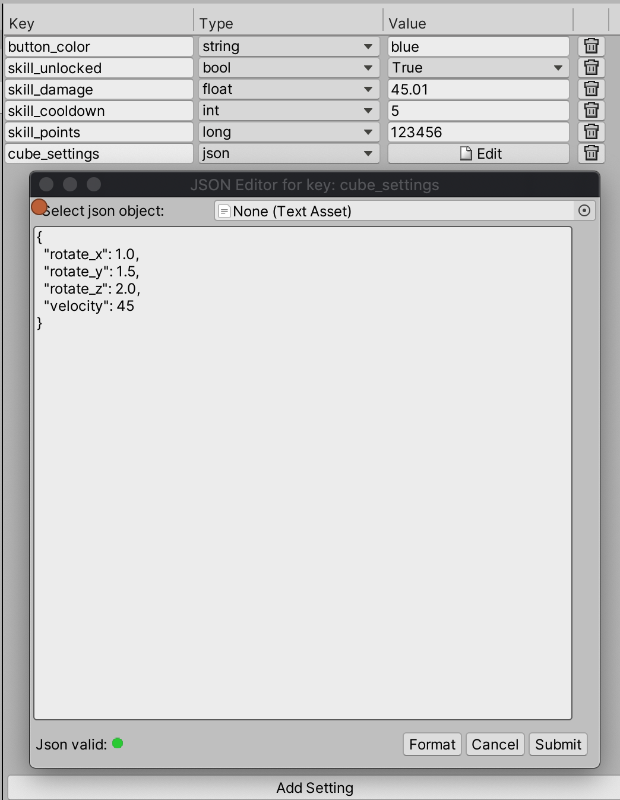

## Adding new Rules
To create a new Remote Config Rule in the **Remote Config** window, click the **Add Rule** button. Each Rule has five parameters, which are detailed below:

* [Name](#name)
* [Condition](#condition)
* [Rollout Percentage](#rollout-percentage)
* [Start Date and Time](#start-date-and-time)
* [End Date and Time](#end-date-and-time)
* [Rule Type - Segmentation](#rule-type-segmentation)
* [Rule Type - Variant](#rule-type-variant)

### Name
The **Name** is the name for your Rule. For example, you might name a difficulty curve Rule `level_1_enemies`, or a seasonal event Rule `halloween_event`.

### Condition
The **Condition** is a JEXL expression (see **JEXL support** section below) of contextual data attributes used to define the audience for which you want a Rule to apply. You can use multiple criteria to define this segment. Remote Config currently supports three attribute categories:

* The **user** category contains custom developer-defined attributes that describe the user (for example, subscriber status, name, age), which you must pass to [ConfigManager.FetchConfigs<T, T2>(T userAttributes, T2 appAttributes)](../api/Unity.RemoteConfig.ConfigManager.html).

  **Note:** When using `SetCustomUserId`, the id you pass in is automatically attached to your `user` attributes as `customUserId`. See the [REST API documentation](https://remote-config-api-docs.uca.cloud.unity3d.com/#tag/Rules/paths/rules?projectId={projectId}/post) for more details.

* The **app** category contains custom developer-defined attributes that describe the application (for example, connectivity status, app version, current level), which you must pass to [ConfigManager.FetchConfigs<T, T2>(T userAttributes, T2 appAttributes)](../api/Unity.RemoteConfig.ConfigManager.html).
* The **unity** category contains predefined attributes, detailed in the table below:

| **Attribute** | **Description** | **Example** |
| ------------- | --------------- | ----------- |
| `unity.appBuildVersion` | The build number your application is running (set this in the Editor by navigating to **Edit** > **Project Settings** > **Player**). | `unity.appBuildVersion == '1'` |
| `unity.appVersion` | The version your application is running (set this in the Editor by navigating to **Edit** > **Project Settings** > **Player**). | `unity.appVersion == '1.0'` |
| `unity.cpu` | The name of the cpu processor. | `unity.cpu == 'Intel(R) Core(TM) i7-7920 HQ CPU @ 3.10GHz'` |
| `unity.cpuFrequency` | The processor frequency in MHz of the device running your app. | `unity.cpuFrequency >= 3100` |
| `unity.country` | The applicable country. This attribute uses [ISO 3166-1 alpha2](https://en.wikipedia.org/wiki/ISO_3166-1_alpha-2) country codes.<br><br>See documentation on [Code integration](CodeIntegration.md) for information on defining custom attributes. | `unity.country == 'US'` |
| `unity.language` | The applicable language. This attribute uses [ISO 639-1](https://en.wikipedia.org/wiki/List_of_ISO_639-1_codes) language codes.<br><br>See documentation on [Code integration](CodeIntegration.md) for information on defining custom attributes. | `unity.language == 'en'` |
| `unity.osVersion` | The operating system version of the device running your app. | `unity.osVersion == 'Mac OS X 10.14.4'` |
| `unity.platform` | The applicable device or platform. The following values are valid:<br><br><ul><li>`Android`</li><li>`iOS`</li><li>`Linux`</li><li>`macOS`</li><li>`Metro`</li><li>`SamsungTV`</li><li>`Switch`</li><li>`Tizen`</li><li>`tvOS`</li><li>`WebGL`</li><li>`Wii`</li><li>`Windows`</li></ul> | `unity.platform == 'iOS'` |
| `unity.timeSinceStart` | The time in milliseconds since a session of your app has begun. | `unity.timeSinceStart >= 60000` |
| `unity.graphicsDeviceVendor` | Vendor of the user’s graphic card. | `unity.graphicsDeviceVendor == 'ATI Technologies Inc.'` |
| `unity.ram` | Amount of ram memory in MB on the device. | `unity.ram >= 16384` |
| `unity.model` | The model of the device. | `unity.model == "LGE Nexus 5"` or `unity.model.contains("Nexus")` |

**Note**: The `unity` attributes listed are subject to change. For a complete updated list, please view the [REST API documentation](https://remote-config-api-docs.uca.cloud.unity3d.com/).

For example, if you want to define a Rule that targets users with a score greater than 10, you can define a `score` property from the `app` context using dot notation:

```
app.score >= 10
```

You can also reference multiple attributes within the same Rule:

```
user.score >= 10 && app.level == 5
```

To define a Rule that matches all conditions and always applies, simply enter `true`.

#### JEXL support
Remote Config supports the [Java Expression Language (JEXL) spec](http://commons.apache.org/proper/commons-jexl/reference/syntax.html), with some exceptions:

* Remote Config only supports Expressions.
* Remote Config does not support Scripts.
* Remote Config does not support functions or conditionals at this time.
* Though Remote Config supports multiple criteria using `&&` and `||` statements, the JEXL string cannot exceed 500 characters.

**Note**: You cannot nest attributes (for example, `app.level1.score`). Using an invalid JEXL string, or leaving the **Condition** field blank results in an error.

### Rollout Percentage
The Rollout Percentage dictates the percentage of your user base that will adhere to this rule. For values less than 100, Unity randomly assigns the Rule to that percent of your players on a user ID basis. While experiences may differ from player to player, each individual player will have a consistent experience across play sessions. This parameter is particularly useful when combined with analytics to parse results.

### Start date and time
You can optionally specify a start date and time, which dictates when the Rule takes effect. Timestamps are represented as strings in the [ISO 8601](https://en.wikipedia.org/wiki/ISO_8601) UTC format (`YYYY-MM-DDThh:mm:ssZ`). If you do not specify a value, the Rule immediately takes effect upon [activation](#activating-and-deactivating-rules).

### End date and time
You can optionally specify an end date and time, which dictates when the Rule ceases to be active. Timestamps are represented as strings in the [ISO 8601](https://en.wikipedia.org/wiki/ISO_8601) UTC format (`YYYY-MM-DDThh:mm:ssZ`). If you do not specify a value, the Rule remains in effect until you [deactivate](#activating-and-deactivating-rules) it.

In the example below, the Rule only applies to players who meet the conditional criteria between October 1, 2019 and November 1, 2019.

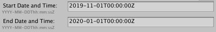

## Applying Settings to a Rule
To apply a Setting to a Rule, highlight the desired Rule to view a list of all the available Settings in the right panel. Check the box next to each Setting you wish to apply.

**Note**: Changes do not take effect until you push updates to the service. For more information, see [updating Rules and Settings](#updating-rules-and-settings).

<a name="activate"></a>
## Activating and deactivating Rules
Use the checkbox next to a Rule to activate or deactivate it. Click the **Push** button at the bottom of the **Remote Config** window to store your Rules and Settings remotely. Until you do so, your configurations are only stored locally. Make sure you push your changes to save them before switching Remote Config environments.

You can delete a Rule or Setting by clicking the minus (**-**) button next to the respective element you wish to delete. Note that you cannot delete a Setting if an active Rule is currently using it.

## Prioritizing Rules
You can assign each Rule a weighted priority value between `1` (highest priority) and `1000` (lowest priority). To do so, click the **Priority** field next to the desired Rule, and enter an integer value.

* New Rules and the **Settings Config** config default to `1000`, the lowest priority.
* In the event of a conflict, priority is awarded to the Rule that was created first.
* You can only edit the **Priority** field if its Rule is not active.

## Updating Rules and Settings
To edit a Rule and save your changes:

1. [Deactivate](#activating-and-deactivating-rules) the Rule.
2. Edit the desired fields in the right column.
3. Click the **Push** button to save your changes to the remote service.
4. Click the **Pull** button to retrieve your latest remote settings from the service.
   1. Verify that the update applied.
5. [Reactivate](#activating-and-deactivating-rules) the Rule.
   1. Push your changes.
   2. Pull again to confirm that the Rule is properly updated and active.

**Note**: When you pull remote changes to your local configuration, the settings retrieved from the service overwrite and delete your local settings.

### Manipulating Json setting value 
If you are using settings of type JSON, the **Remote Config** window displays the **JSON Editor** dialog.
This lets you format and validate the JSON value.
To open this window, press the **Edit** button for the JSON setting:
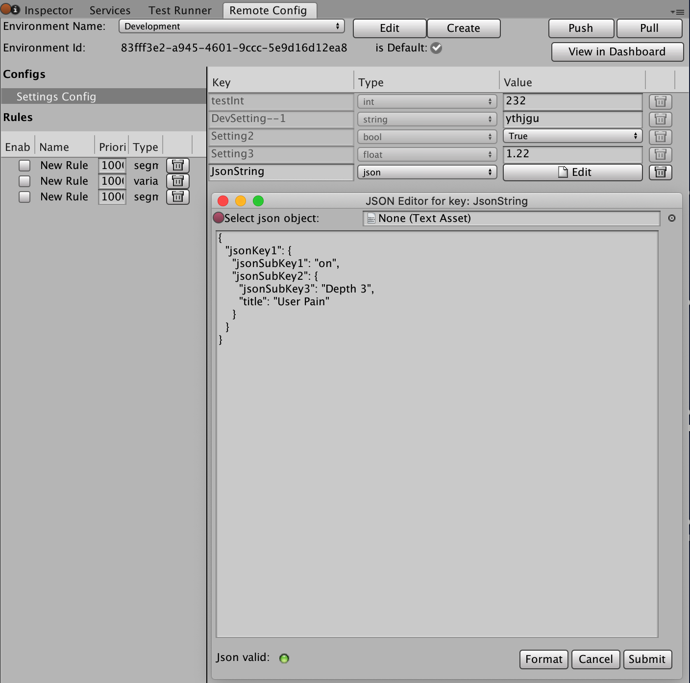

If you enter a valid but unformatted JSON value, the validation indicator is green. Use the **Format** button to reformat the JSON object.
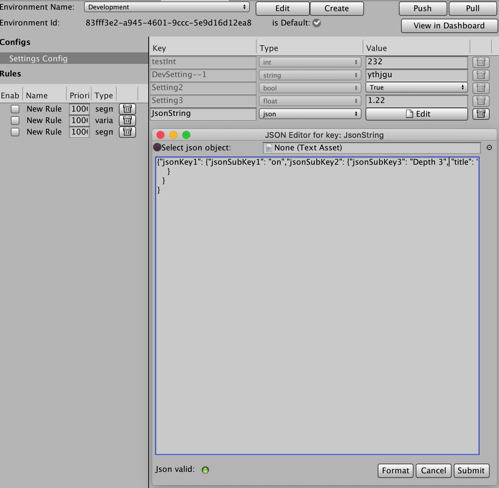

If the json value is invalid, the validation indicator is red and you cannot submit the JSON object.
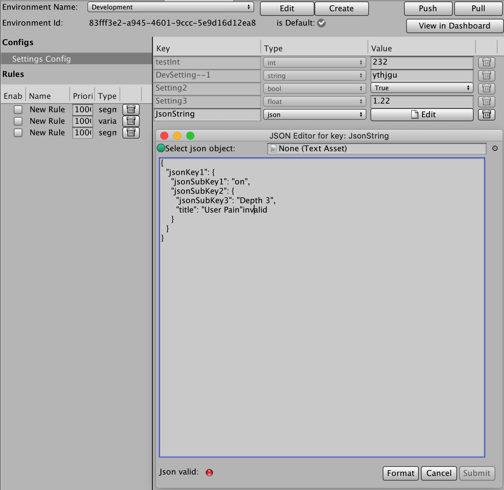

The **Select json object** field lets you load a JSON file (if available from your `/Assets` folder. To choose a file, click the button to the right of the field.
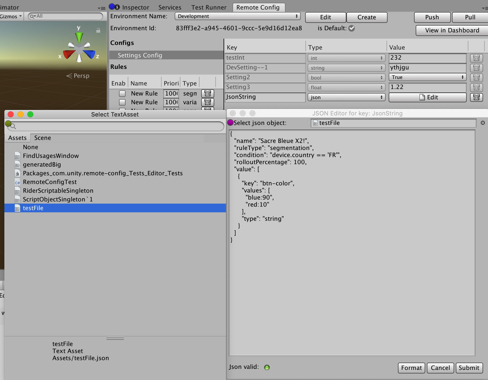

### Updates and client sessions
You do not need to deploy a new version of your application to propagate changes to your configuration. Client devices request a refresh of your Remote Config settings whenever players initiate a new session of your application. Remote Config defines a new session when the user launches the application, or returns to the application after it has been in the background for at least 30 minutes.

If the client has no internet connection and cannot communicate with the Remote Config service, the application uses the last settings it received and cached.

**Note**: Requesting settings from the Remote Config service is an asynchronous process that might not complete before your initial Scene finishes loading, or in some edge cases might not complete at all. Therefore, always initialize your game variables with reasonable defaults.

## Example use cases
Below are some examples of how you might implement Rules and Settings for your game.

### Dynamic difficulty curve
Create Rules that target players in specific levels, with Settings that dynamically adjust, for example:
* The number of enemies in the level
* How much health enemies have
* How much damage enemies inflict

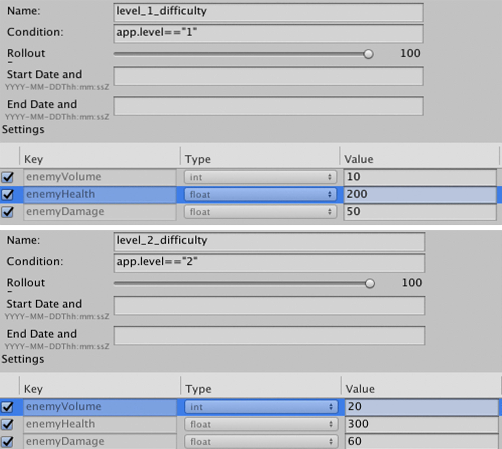

In this example, you would implement a custom `app` condition to determine what level the player is in.

### Holiday event
Create Rules that target players in regions that celebrate a holiday, to apply between specific dates surrounding that day. Create Settings to:
* Enable or disable the event
* Test price points for a limited edition event pack
* Swap out asset models to create a festive environment

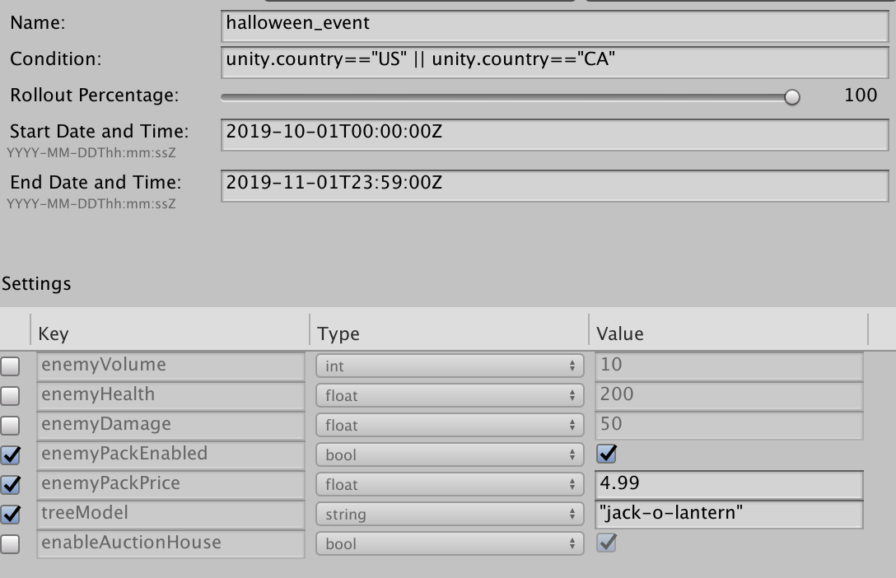

### Beta feature
Create Rules targeting early adopters of your game to beta test a new feature. Create Settings to flag users for access to content.

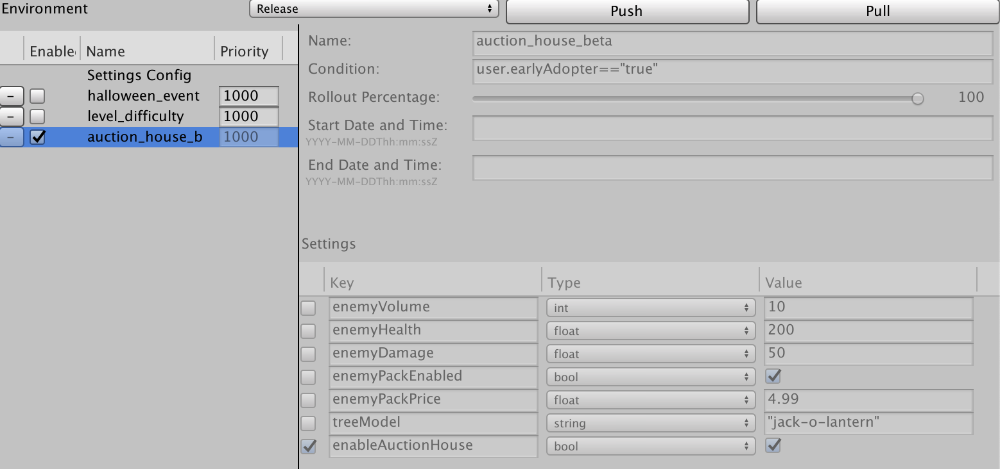

In this example, you would implement a custom `user` condition to flag early adopter status.

## Rule type segmentation
Rules of type `segmentation` map a single Config value override per setting.
If a Rule is enabled and its condition is evaluated to 'true', then each setting listed in the Rule is set to the defined value when assigned at runtime.
To add a Rule of type `segmentation`, click **Add Rule**.
`segmentation` is the default type for new rules.


## Rule type variant
Rules of type `variant` let you define multiple variants per setting in a Rule to select from at time of assignment.
The most common use case for `variant` rules is to create the the infrastructure required to set up an 'AB Test' Rule.
For this, create a Rule and add a list of multiple variant values mapped to a setting; instead of just a single value.

At runtime, the Remote Config picks a variant from the list defined in the Rule to return to the requesting user.

To add a Rule of type `variant`, click **Add Rule**.
The new Rule's type will default to `segmentation`:


In the **Type** dropdown, select **variant**.

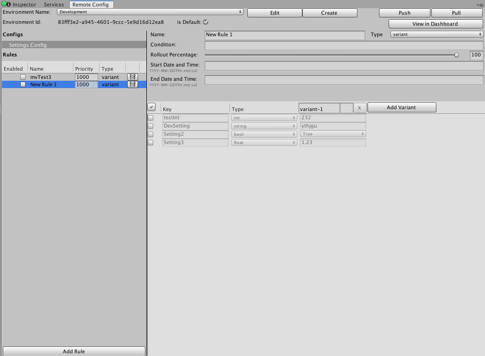
### Variant configuration
Each setting listed in the Rule includes one value by default. To add more, click the **Add Variant** button.
Each additional variant has a **name** field and **weight** field.

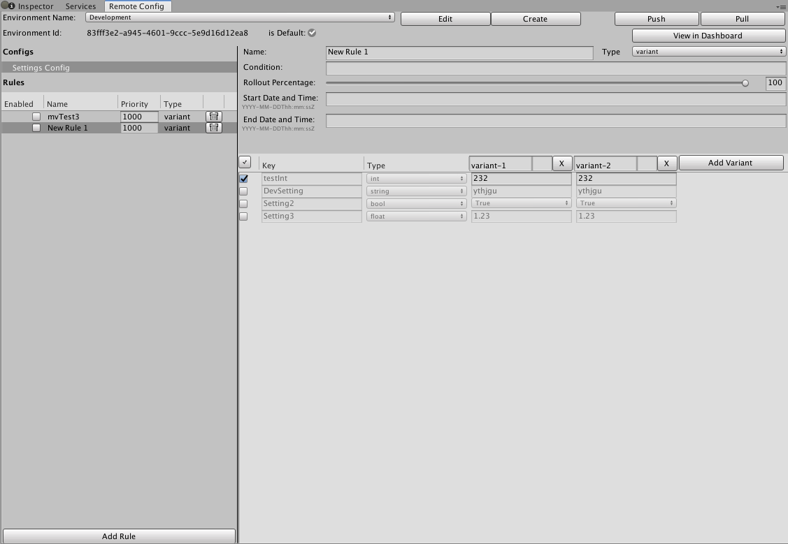

When sending requests, each Rule configuration has a list of objects:
```json
{
   "id":"<uuid>",
   "name":"<rule_name>",
   "value":[
      {
         "key":"key1",
         "type":"string",
         "values":[
            {
               "name":"variant-1",
               "value":"A",
               "weight":50
            },
            {
               "name":"variant-2",
               "value":"B",
               "weight":50
            }
         ]
      }, ...
   ]
}
```
### Weighted variants
Remote config uses variant weights to decide which variant to pick from the list defined in the rule.

You can assign weights to variants when configuring each variant in the list.

This field is conditionally optional: either all variants must have a defined weight, or no variants must have a defined weight.

If the weights for a list of variants are all undefined, Remote Config picks from the list of variants randomly and uniformly.
For example, if a developer creates a Rule that maps four variant values to a config key without defining variant weights,
then each variant has a 25% chance of being selected at the time of assignment.

When you define variant weights for a rule:
* All the weights listed in the Rule must equal 100% when creating or updating the Rule
* All the variants must have a weight

If these conditions are not met, then the API returns an error instructing the user to review the specified weights.

### Variant names and reporting
Rule variants are defined as an independent data structure. They have a GUID for internal tracking and a human readable name that you can set when you configure the Rule.

Remote Config appends the variant name to the assignment event when serving assignments to users at runtime.
This lets the [assignment summary and aggregate reports](AssignmentReports.md) measure how often each variant was selected.

## Code integration
Once you’ve configured your Rules and Settings, [integrate Remote Config](CodeIntegration.md) with your game code.